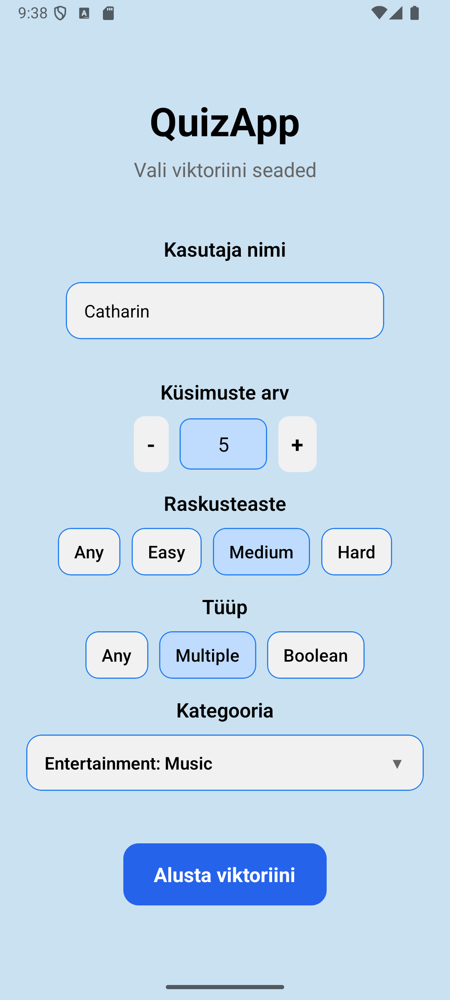
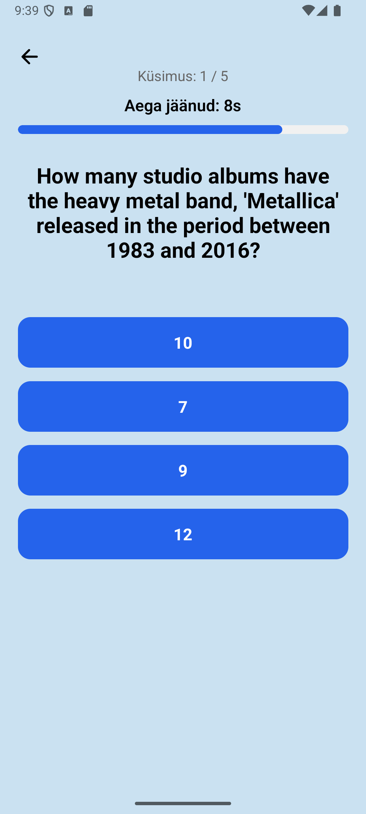
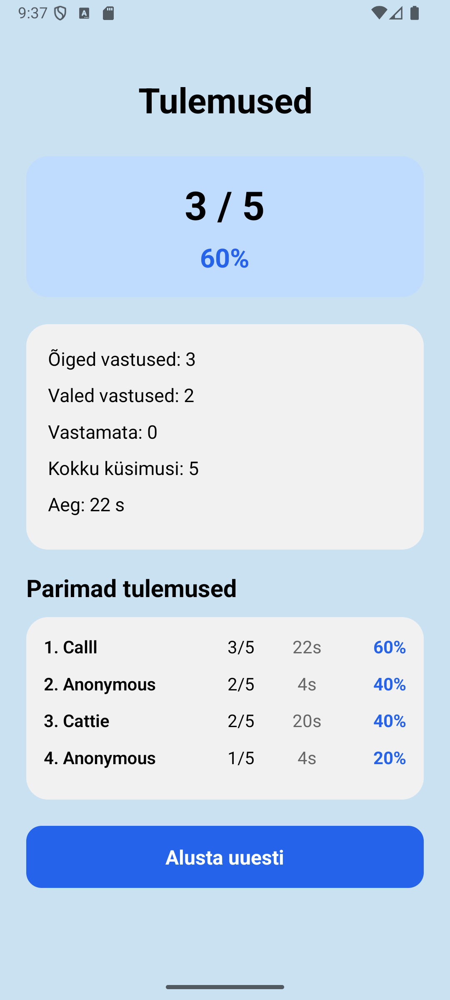

# QuizApp

React Native / Expo viktoriinirakendus, mis kasutab Open Trivia Database API-t.

## Kirjeldus

Rakendus võimaldab kasutajal seadistada viktoriini (küsimuste arv, kategooria, raskusaste ja tüüp), vastata küsimustele ajapiiranguga ning näha oma tulemust koos edetabeliga.

Küsimused laetakse reaalajas OpenTDB API-st ning tulemused salvestatakse lokaalselt SQLite andmebaasi.

## Funktsionaalsus

- Küsimuste laadimine Open Trivia Database API-st
- Viktoriini seadistamine:
  - kasutajanimi
  - küsimuste arv
  - kategooria
  - raskusaste (easy, medium, hard)
  - küsimuse tüüp (multiple, boolean)
- Vastuste juhuslik segamine
- 10-sekundiline taimer iga küsimuse jaoks koos progressiribaga
- Õigete, valede ja vastamata vastuste arvestus
- Tulemuste kuvamine (punktid, protsent, aeg)
- Tulemuste salvestamine SQLite andmebaasi
- Edetabel (top 5), sorteeritud:
  1. protsendi järgi (kõrgem parem)
  2. punktide järgi
  3. aja järgi (kiirem parem)

## Tehnoloogiad

- Expo
- React Native
- TypeScript
- Open Trivia Database API
- Expo SQLite

## Paigaldus ja käivitamine

Installi sõltuvused:

```bash
npx expo start
```

Seejärel:

- vajutada a — käivitada Android emulatoris
- vajutada w — avada veebis
- skaneerida QR-koodi Expo Go rakendusega telefonis

## Projekti struktuur

- `App.tsx` — rakenduse alguspunkt ja ekraanide vahetamine.
- `screens/SettingsScreen.tsx` — viktoriini seadete vorm.
- `screens/QuizScreen.tsx` — küsimuste laadimine, taimer ja vastamise loogika.
- `screens/ResultScreen.tsx` — tulemuste ja edetabeli kuvamine.
- `services/TriviaApi.ts` — küsimuste päringud OpenTDB API-st.
- `services/TriviaCategory.ts` — OpenTDB kategooriate päringud.
- `database/db.ts` — SQLite tabeli loomine ja tulemuste salvestamine.
- `components/` — korduvkasutatavad UI komponendid
- `constants/` — värvide ja stiilide konfiguratsioon

## Kasutamine

1. Sisesta kasutajanimi max 12 tähti
2. Vali viktoriini parameetrid
3. Vajuta "Alusta viktoriini"
4. Vasta küsimustele enne aja lõppu
5. Vaata tulemust ja edetabelit
6. Vajuta "Alusta uuesti", et minna tagasi seadistuste juurde

## Screenid ja video

### Seade ekraan



### Küsimuste ekraan



### Tulemuste ekraan



### Vaata DEMO


(https://youtube.com/shorts/KJelbHIq0yQ?feature=share)

## Märkused

- Kui valitud parameetritega küsimusi ei leita, kuvatakse veateade
- Kasutaja saab sel juhul minna tagasi seadistuste ekraanile
- Tulemused salvestatakse lokaalselt (ei kasutata serverit)

## Autor

Jekaterina Shashkina
